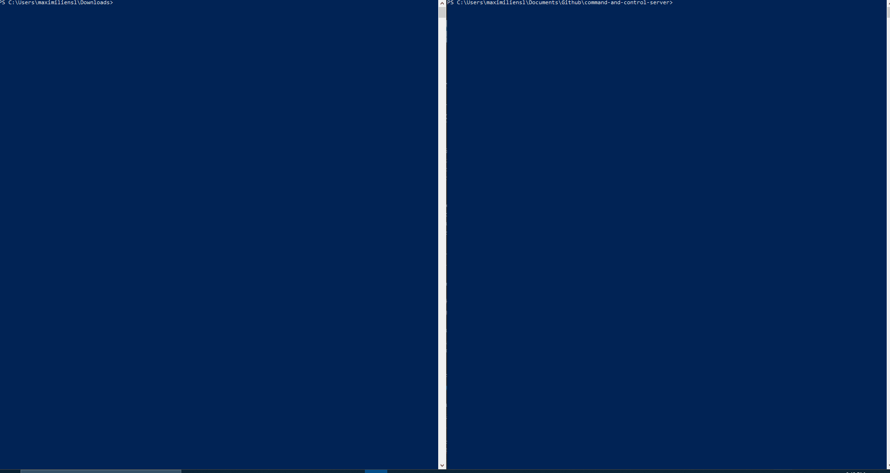

# Command And Control Server

## Preview

## How To Run This Program

First, make sure [Python 3](https://www.python.org/downloads/) and [pip](https://pypi.org/project/pip/) are both installed on the computer running the Command and Control
server and the target client.

Then install the aiohttp module :

	pip3 install aiohttp
  
Once the aiohttp module is installed, run the C2Server.py script on the computer that will act as the server :

	python C2Server.py
  
Finally, run the TargetClient.py script on the computer that will act as the infected computer :

	python TargetClient.py
  
 

## IMPORTANT NOTICE

This source code is still in progess and is meant for educational purposes only. It should not be used for malicious activity.

In order for this script to work, the Command and Control Server and the infected computer must both run on Windows 10 since the script uses Powershell commands.

## Description

Project to showcase the interaction in a botnet between a Command and Control server and an infected computer

Note: to change the default port to something other than port 7000 (like port 83 for example), just add port=83 in the last line of the C2Server.py script as follows:

	web.run_app(app, port=83)

If the target client and the server are not running on the same computer while testing this script, you'll have to replace the 127.0.0.1 IP address with the
given IP address for the server on each of these lines in TargetClient.py :

	session.get('http://127.0.0.1:7000/validate/status')
